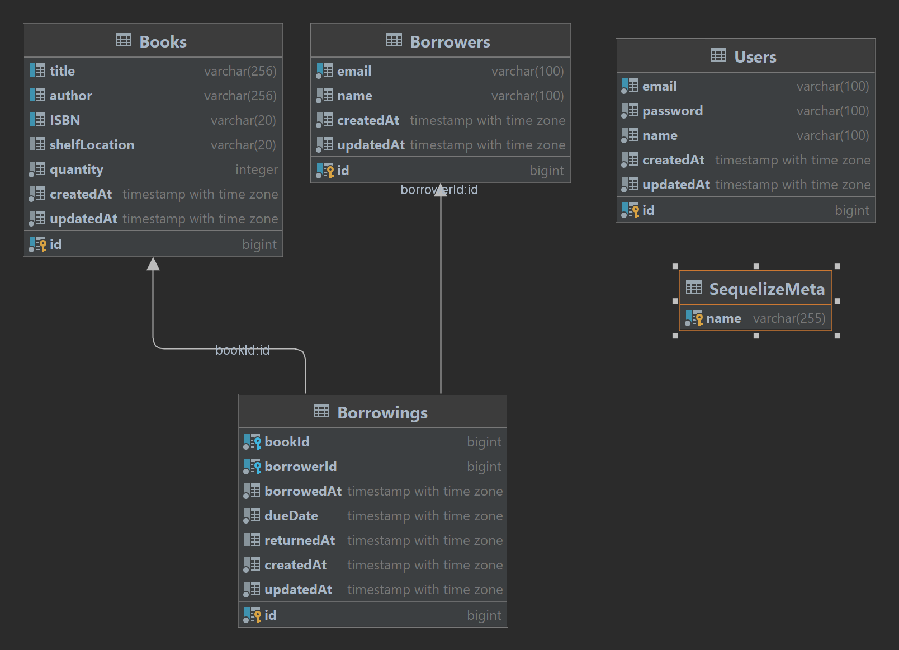

# Library Management System

This backend application manages the borrowing and returning of books in a library system.


## Database Schema


The database schema diagram can be found in the following image:




## Installation

1- Clone the repository:
```bash
  git clone https://github.com/MahmoudMehisen/Library-Management-System
```
2- Navigate to the project directory:

```bash
  cd Library-Management-System
```

3- Ensure that ports 5432 (PostgreSQL) and 8080 (Node.js backend) are free to use.

4- Run Docker Compose to set up the environment:

```bash
  docker-compose up
```

Docker will handle the database setup and migrations using the scripts provided in the backend, ensuring everything is properly configured.


## API Reference

To interact with the API endpoints, you can use the Postman collection provided in the `Library-Management.postman_collection.json` file.

### Auth
```bash
Login: POST localhost:8080/api/auth/login
Register: POST localhost:8080/api/auth/register
```

### Book
```bash
Add Book: POST localhost:8080/api/book/ (Bearer token required)
Update Book: PUT localhost:8080/api/book/:id (Bearer token required)
Delete Book: DELETE localhost:8080/api/book/:id (Bearer token required)
All Books: GET localhost:8080/api/book/all (Bearer token required)
Search Books: GET localhost:8080/api/book/search?key=author&query=author (Bearer token required)
```

### Borrower
```bash
Add Borrower: POST localhost:8080/api/borrower/ (Bearer token required)
Update Borrower: PUT localhost:8080/api/borrower/:id (Bearer token required)
Delete Borrower: DELETE localhost:8080/api/borrower/:id (Bearer token required)
All Borrowers: GET localhost:8080/api/borrower/all (Bearer token required)
```

### Borrowing
```bash
Create Borrowing: POST localhost:8080/api/borrowing/create-borrowing (Bearer token required)
Return Book: POST localhost:8080/api/borrowing/return-book (Bearer token required)
Borrowed Books By Borrower: GET localhost:8080/api/borrowing/borrowed-books-by-borrower/:borrowerId (Bearer token required)
Overdue Books: GET localhost:8080/api/borrowing/overdue-books (Bearer token required)
```

Please ensure you have the correct bearer token before making requests to protected endpoints.


